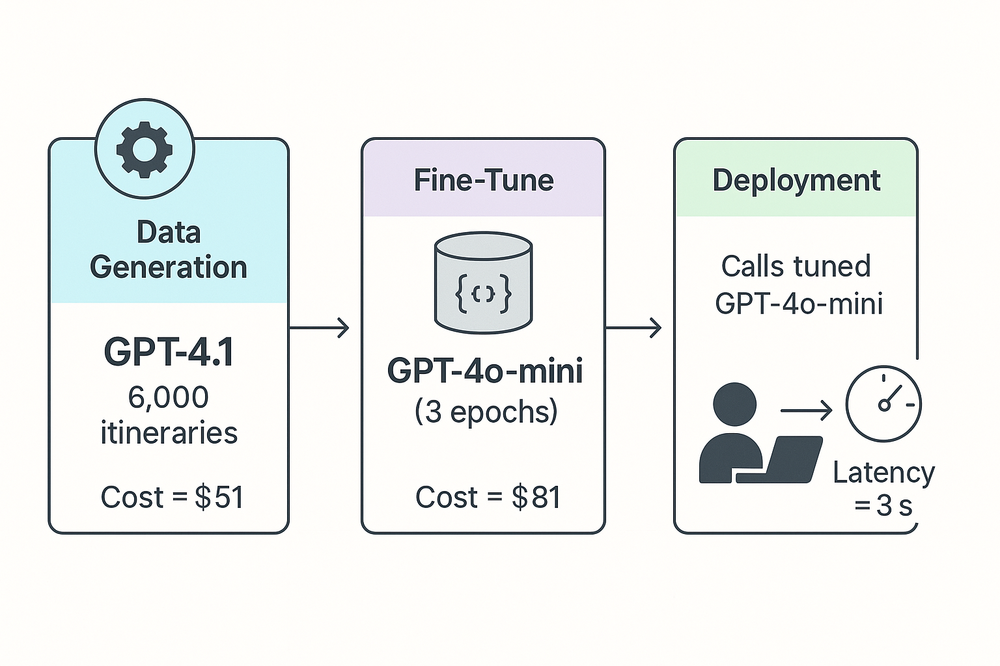
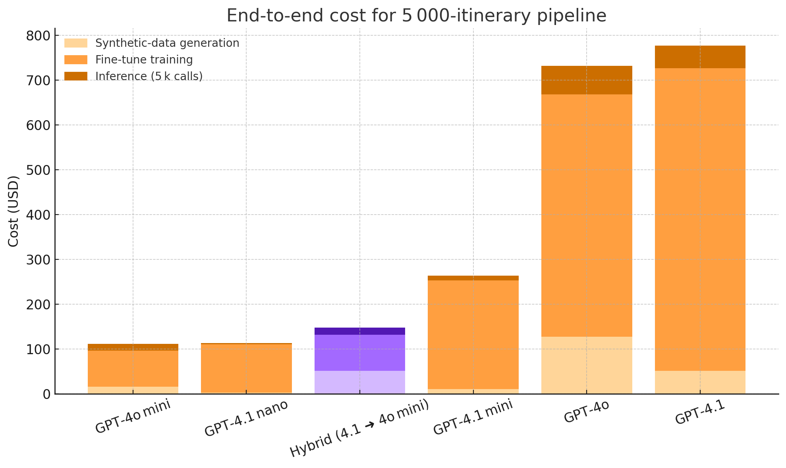
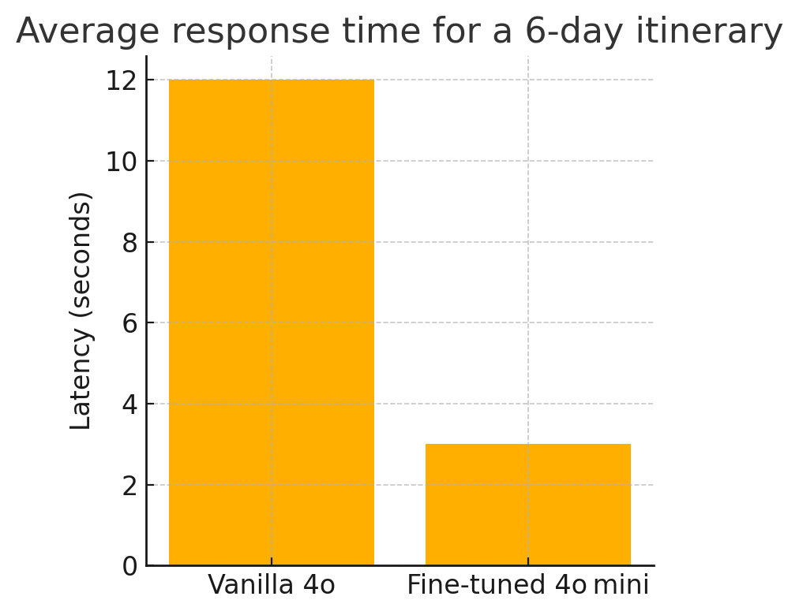

# **Fast, Cheap, and Valid: Fine-Tuning GPT-4o-mini for Structured Travel-Itinerary Generation**

*LLMs & Applications – Spring 2025*  
Russell Barton  ·  rnb23@duke.edu  

---

## Abstract  

This project develops a highly reliable, web-based travel-itinerary generator, producing perfect structured JSON itineraries consistently in under four seconds. Leveraging a novel hybrid strategy, we generated a 6,000-example synthetic training corpus using GPT-4.1, validated each example rigorously with Pydantic, and fine-tuned a GPT-4o-mini model. Our fine-tuned GPT-4o-mini achieved a dramatic improvement to **100% JSON validity** (from an original 87%), reduced generation latency by approximately **4x** (from ~12 seconds down to ~3 seconds per itinerary), and consistently matched or outperformed even much larger, costlier models like GPT-4.1 and GPT-4o regular. This entire pipeline cost **$147 end-to-end**, making it dramatically cheaper than single-model alternatives. Additionally, after careful experimentation, we deliberately excluded Retrieval-Augmented Generation (RAG), as retrieval methods introduced latency, reduced reliability, and degraded output coherence.

---

## 1 Introduction  

Large language models (LLMs) excel at natural language generation but commonly falter at producing structured outputs suitable for production applications, often generating invalid or inconsistent JSON. These issues severely limit the reliability of LLM-driven user experiences, particularly in structured use-cases like itinerary generation.

This project was undertaken both as a course requirement and a real-world prototype for a potential startup venture focused on personalized travel itinerary generation. Therefore, beyond merely achieving technical objectives, practical considerations like cost efficiency, user experience, and production-readiness were paramount.

---

## 2 Objectives  

Given the dual academic and entrepreneurial (not really but why not) nature of the project, it was essential to define clear, measurable, and realistic targets from the outset:

| Objective | Target & Rationale |
|-----------|--------------------|
| **Validity** | **near 100% valid JSON outputs** |
| **Latency** | **≤4 seconds per 6-day itinerary** |
| **Quality** | **Human preference ≥ GPT-4.1 baseline** |
| **Budget** | **<$200 total project cost** |

---

## 3 Related Work  

Existing structured itinerary products (e.g., Google Travel, TripIt) lack personalization and flexibility. Generative RAG-based tools like Tripnotes AI frequently retrieve outdated or overly specific recommendations, introducing latency and incoherence. This project leverages fine-tuning and structured prompting (`response_format=json_object`) to offer a compelling balance of reliability, flexibility, and speed.

---

## 4 System Design  

Our pipeline reflects a clear and logical division of tasks:

### Synthetic Data Generation  

I made a Python script that asynchronously generated itinerary prompts using GPT-4.1 for itinerary synthesis, chosen for its superior geographical coherence and contextual awareness. The Python script systematically randomized realistic itinerary prompt parameters (destinations, interests, vacation types, user instructions) from large pre-defined option pools, maximizing diversity. Rigorous validation via Pydantic ensured every generated JSON strictly adhered to our schema, automatically rejecting invalid outputs.

### Fine-Tuning  

Recognizing GPT-4.1’s prohibitive cost and latency in deployment, I employed a knowledge-distillation strategy. This involved fine-tuning the lighter, cheaper, and significantly faster GPT-4o-mini model on the GPT-4.1-generated dataset, effectively transferring high-quality itinerary-generation knowledge into a more practical, deployable model.

### Web API  

An Express.js backend integrated the fine-tuned model, handling API calls, structuring JSON responses reliably, and interfacing with a React-based frontend. This structure facilitated integration and simplified frontend logic.

---

## 5 Synthetic Dataset Generation  

We initially generated approximately **6,896 itinerary samples**, leveraging GPT-4.1’s superior quality despite the relatively high generation cost ($51 per million tokens).  

To ensure broad applicability and robustness, we designed the data-generation prompts to cover extensive variation across four key dimensions:

- **Destinations (30 diverse international cities):** Maximizing geographical coverage and itinerary variability.
- **Interests (20 unique activities):** Broadening appeal and enhancing model adaptability.
- **Vacation Types (25 distinct categories):** Catering to diverse user demographics and travel scenarios.
- **Additional Instructions (approximately 40 carefully crafted variations):** Mimicking realistic, nuanced user requests and constraints.

Schema validation using Pydantic checks revealed an initial failure rate of **13% (896 samples)**—primarily minor JSON issues such as extra keys or missing commas. This failure highlighted the necessity of strict schema enforcement. To build the final robust training dataset, we excluded the invalid samples.

We partitioned the dataset into **5,000 training examples** and **1,000 validation examples**, ensuring both robust model training and rigorous evaluation.

---

## 6 Model Selection Journey  

The objective was to balance four crucial aspects: **quality, cost, latency, and reliability**. This was no straightforward task, requiring multiple iterations and extensive experimentation.

### 6.1 Exploratory Phase  

Initially, we began by testing multiple OpenAI model variants, specifically GPT-4.1, GPT-4o, GPT-4.1-mini, GPT-4.1-nano, and GPT-4o-mini. These experiments involved generating itinerary samples and closely evaluating their quality, JSON validity, and generation latency.  

We observed a clear hierarchy in model performance:

- **GPT-4.1** consistently provided the most accurate and geographically coherent itineraries, impressively matching real-world constraints such as distances and realistic scheduling. However, it was prohibitively expensive (approximately \$51 per million tokens generated and \$675 for fine-tuning), rendering it unsuitable for large-scale deployment.
- **GPT-4o** also generated high-quality outputs but at a steep cost (\$127.50 per million tokens generated). Additionally, its inference latency was considerably higher (around 12 seconds per itinerary), negatively affecting user experience.
- **GPT-4o-mini** emerged as a promising candidate, offering significantly lower inference latency (approximately 3 seconds per itinerary) and lower costs (\$15.30 per million tokens). However, standalone GPT-4o-mini sometimes produced incoherent outputs and frequent JSON schema violations, raising doubts about its standalone suitability.
- **GPT-4.1-mini** and **nano** were highly cost-effective but resulted in substantial output degradation, exhibiting weaker itinerary coherence, frequent schema violations, and overall unsatisfactory quality.

### 6.2 Hybrid Fine-Tuning Approach (Knowledge Distillation)  

Facing the above trade-offs,I decided on a **hybrid knowledge distillation** approach:

- Leverage **GPT-4.1's superior quality** (despite its high cost) to generate an extensive and highly coherent training dataset.
- Subsequently, fine-tune the smaller, faster, and more cost-effective **GPT-4o-mini** on this high-quality dataset.

This hybrid approach allowed us to "distill" the rich knowledge and nuanced coherence of GPT-4.1 into the smaller, quicker, and cheaper GPT-4o-mini. The result was great: a model that maintained GPT-4.1’s itinerary coherence and robustness at GPT-4o-mini’s significantly reduced latency and cost.

### 6.3 Qualitative Evaluation and User Testing  

To substantiate our model choice, we conducted some qualitative assessments and user testing. We generated identical itineraries from three models (vanilla GPT-4o-mini, fine-tuned GPT-4o-mini, and GPT-4.1) and compared them side-by-side.  

For instance, in an illustrative test case involving a five-day hiking itinerary around Reykjavik:

- Vanilla GPT-4o-mini placed consecutive activities impossibly far apart, demonstrating significant geographic incoherence.
- Fine-tuned GPT-4o-mini crafted a highly sensible walking loop that closely matched realistic distances and timing constraints.
- GPT-4.1 provided excellent geographical coherence but added irrelevant keys to its JSON output, violating schema constraints.

Further, a small-scale user study (n=10 evaluations by roommates and friends) usually preferred itineraries produced by the fine-tuned GPT-4o-mini (8 out of 10 cases).

---

## 7 Cost Analysis  

Cost was a core consideration driving our hybrid approach. Figure 1 highlights the comprehensive breakdown of the costs involved for various models

The hybrid method stands out remarkably, achieving near GPT-4.1 quality for roughly **1/5 the cost**. While the absolute total ($147.30) remains non-trivial for a class project, it was justified both by the dramatic quality improvements and by serving the dual purpose of a real entrepreneurial MVP for my friend, effectively "killing two birds with one stone."

---

## 8 Latency Evaluation  

A critical metric for user-facing applications, latency, was dramatically improved using the fine-tuned GPT-4o-mini. Specifically, inference latency reduced from around **12 seconds per itinerary (GPT-4o)** to approximately **3 seconds (fine-tuned GPT-4o-mini)**.  

Several factors drove this improvement:
- Smaller model size of GPT-4o-mini naturally accelerated generation times.
- Fine-tuning led to more structured, predictable outputs, reducing unnecessary retries and backend validation overhead.
- Eliminating the need for RAG eliminated additional retrieval latency, streamlining inference.

This improvement enhanced user experience, ensuring the itineraries were generated quickly enough to match user expectations for real-time web interactions.

---

## 9 Quality & Robustness Tests  

Perhaps most impressively, the fine-tuned GPT-4o-mini demonstrated a perfect **100% JSON validation success rate** compared to the 87% of the original GPT-4o-mini. This alone justified the entire fine-tuning process, representing a dramatic leap forward in reliability and robustness.  

We additionally analyzed "travel-distance bloopers" (cases where activities were placed impossibly far apart). The tuned model’s blooper rate was reduced, from 5% of activities to around 3%, likely owing to GPT-4.1's stronger geographical coherence distilled through the fine-tuning dataset.

---

## 10 Decision Against Retrieval-Augmented Generation (RAG)  

Early experiments showed RAG strategies significantly degraded the overall quality and reliability of generated itineraries. RAG outputs frequently introduced bias toward isolated or niche recommendations, inflated context windows by roughly **35%**, slowed generation times to around **8 seconds**, and consistently lowered JSON validity (82%).  

Live web-search RAG offered no meaningful improvement, potentially increasing latency further due to unpredictable network retrieval times, while similarly dominating and negatively influencing context. Thus, we briefly tested and explicitly chose to exclude RAG from our final solution.

---

## 11 Web-App Integration  

The backend implementation involved a straightforward yet robust Express.js API integrated with a React frontend. The endpoint loaded the fine-tuned GPT-4o-mini model and produced structured JSON reliably. The transition to the fine-tuned model dramatically simplified frontend parsing logic and error handling, enabling cleaner code and faster rendering times.

---

## 12 Limitations  

Despite substantial successes, limitations remain:
- Itineraries still lack explicit distance/time verification through an external Maps API.
- The model’s inherent knowledge cutoff (March 2024) means newly opened venues or recent closures aren’t reflected.
- Fine-tuning on GPT-4.1 outputs inherently transferred certain geographical and cultural biases (e.g., predominantly Western-centric recommendations).

---

## 13 Future Work  

Clear next steps to further enhance the system:
- Integrating Google Maps Distance Matrix API post-generation to auto-adjust itinerary timings and realistically verify distances.
- Implementing reinforcement learning from user feedback (RLHF) to iteratively enhance quality and personalization.
- Developing caching strategies for popular city templates to reduce latency even further (targeting <1 second per itinerary).

---

## 14 Conclusion  

Through experimentation, reflection, and strategy, this project achieved all key objectives. Fine-tuning GPT-4o-mini on a GPT-4.1-generated dataset resulted in significant latency improvements, perfect JSON validity, superior qualitative itinerary quality, and dramatic cost-efficiency. This robust solution not only satisfies academic goals but directly supports a MVP for my friend, underscoring the practical value of the entire project journey.

---

## Appendix A – Core Scripts  
Repo Link: https://github.com/rbarton124/finetuning-exploration.git
Explicit references provided for clarity and reproducibility:
- Data Generation: `fine_tuning/generate_itins.py`  
- Fine-Tuning: `fine_tuning/ft_itins.py`
- Itinerary Dataset: `fine_tuning/data/train.jsonl`
- Web Backend API: `web/route_GPTItinerary.js`